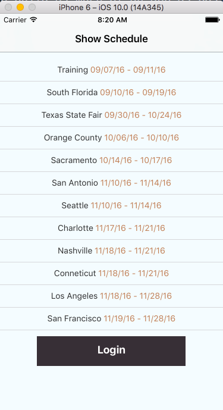

# latitudeDigital

Working with screen shots to build as much of an app as possible using React Native, here are some notes that I have found:

1. There is no "horizontal rule" < hr > in React Native, they are currently trying to get it working with < Text /> and <        TextInput /> but the only way to do it right now is to wrap it with < View > tags which seems pretty hacky. There is a npm    module react-native-hr that looks like that would be an easy fix, just a reminder to check it out.
2. Wasn't able to get the overlay so I pushed the login to another page.
3. Figured out Picker on a later page as to be able to roll through a list of names to be selected.
4. Start survey - a user can add there name and we can store as properties.
5. Not sure on how to structure out the quick domain feature
6. Here is PickerIOS with the time frame and vehicles the user may want
